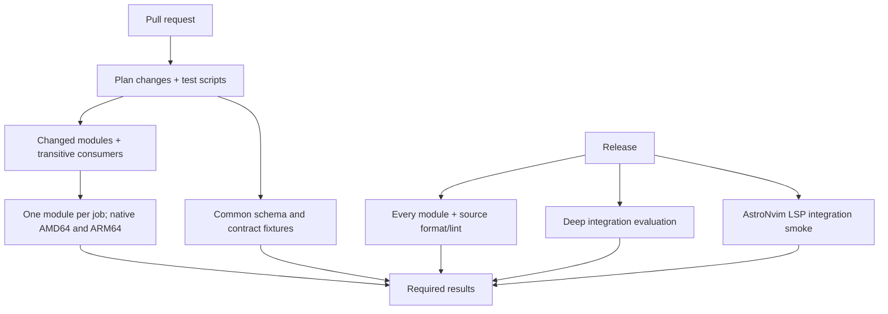

# LimaNix modules

[](LICENSE)

<p align="center">
  
</p>

The NixOS module catalog for [LimaNix](https://github.com/limanix/client).
Select a complete project workbench or compose its tools individually without writing Nix.
Each module owns its configuration, integration contract and tests.

[Catalog](guides/catalog.md) | [Write a module](guides/writing-modules.md) | [Releases](https://github.com/limanix/modules/releases) | [Documentation](https://limanix.dev/categories/nixos/index.html)

## Try the workbench

In your existing `limanix.toml`, select Cozy:

```toml
[nixos]
modules = ["lmx:cozy"]
```

Apply it from your Mac with `limanix update --config limanix.toml`.
Inside the VM, run `tmux-project /workspace` using the mounted project path from your configuration.
The project opens in four windows: editor, shell, Git and containers.
The included Go, Python and Node.js servers connect to AstroNvim through the shared language-support contract.
Yazi keeps the selected shell directory, and the terminal applications share Mocha defaults.
Docker, local Kubernetes tools, AWS and Google Cloud clients, Posting and Harlequin cover the surrounding project workflow.

Cozy does not authenticate cloud accounts or create a Kubernetes cluster.
Start with the client's [complete workspace example](https://limanix.dev/categories/client/workspace.html) or read [Cozy](catalog/cozy/README.md) for its components, project windows and configuration.
The minimal guest retains the platform conventions with `modules = []`.

## Use a module

List selectors in the `[nixos]` table of your `limanix.toml`:

```toml
[nixos]
modules = ["lmx:go", "lmx:docker", "lmx:python-3.12"]
```

Apply the selection with `limanix update --config limanix.toml`, or with `limanix create --config limanix.toml` for a new VM.

- `lmx:NAME` installs the module's default version line, and `lmx:NAME-VERSION` installs a specific one.
- Each directory in [`catalog/`](catalog/) except `_shared` is one module.
  Its README lists the selectors, exact versions, commands, and guarantees.
- `limanix modules list` shows the selectors that your client provides.

The client binary embeds one catalog release and does not download modules.
After a new catalog release, recent client versions are rebuilt with it and published as new builds, such as `v0.0.1+1`.
Install the latest build of your client version to get the updated catalog.
The [release process](https://limanix.dev/releases/index.html) describes the details.

For tools the catalog does not cover, [write your own module](guides/writing-modules.md) and import it with `limanix modules add`.

## Find the right guide

| Topic                                                            | Guide                                        |
|------------------------------------------------------------------|----------------------------------------------|
| Available modules, version lines, and several versions in one VM | [Catalog](guides/catalog.md)                 |
| NixOS modules, how settings combine, package pins, and trust     | [Concepts](guides/concepts.md)               |
| Writing, combining, and contributing a module                    | [Write a module](guides/writing-modules.md)  |
| Catalog ownership, capabilities, compatibility, and required checks | [Catalog contract](guides/catalog-contract.md) |
| Evaluation errors, build failures, services, and catalog checks  | [Troubleshooting](guides/troubleshooting.md) |

The guides and every module README are also published on the [documentation site](https://limanix.dev/categories/nixos/index.html).

## Repository layout

| Path                      | Contents                                                                                       |
|---------------------------|------------------------------------------------------------------------------------------------|
| `catalog/NAME/`           | One module: entry point, metadata, README, configuration checks, and applicable local and smoke tests |
| `checks/`                 | Shared module runner, minimal common checks, and complete catalog integration checks                 |
| `flake.nix`, `flake.lock` | The NixOS release and the base Nixpkgs revision                                                |
| `guides/`                 | The guides listed above                                                                        |
| `scripts/`                | Documentation preparation, the check runner, and the Nixpkgs update summary                    |

## Develop

Install [Task](https://taskfile.dev) 3.53.1 or newer and Docker with a running engine.
Nix runs in a container; you do not need a local Nix installation.

```console
task --yes ci/nixos-fmt ci/nixos-lint ci/test
task --yes ci/common MODE=release
```

See [Taskfile.yml](Taskfile.yml) for the full task list.

`ci/test` runs all module suites on the container's native Linux architecture.
Pass space-separated module directory names to select a subset:

```console
task --yes ci/test MODULES="go rust"
task --yes ci/common
task --yes ci/common MODE=release
```

Each module suite shares memoized configurations between evaluation and smoke checks.
Every runtime profile evaluates all supported versions, repeated entry points and component import orders, comparing complete system and public option values.
Runtime profiles choose which native smoke checks are built and run without rebuilding unchanged base-system packages.

| Stage | Native runtime coverage |
|---|---|
| Declared numeric version-file PR | Current/default startup and corner cases, plus the changed version lines |
| Other pod source PR | Full runtime for that pod and its transitive consumers |
| Shared contract, interface, Nixpkgs pin or shared runtime PR | Full runtime throughout the catalog |
| Workflow-only PR | Current/default runtime for every pod |
| Palette-only PR | Current/default runtime when every shared reference is a known unversioned pod's direct palette read; otherwise full runtime |
| Local checks and release | Full runtime coverage by default |

A PR profile keeps complete compatibility evaluation; it changes native build/run selection.



PR selection includes transitive consumers of changed component entry points.
Changes to shared runtime assets, shared declarations, the Nixpkgs pin, workflows or the runner select every module.
README-only changes keep script tests and common contract checks; source formatting, lint and module smoke are skipped.
The plan reports each module's runtime profile and additional version lines in the job summary.
Module jobs restore separate native source and binary caches and save completed builds even if a later check fails.

`ci/common MODE=pr` is the small shared-contract suite.
Use `MODE=release-eval` for all compatible defaults and documented integration evaluation, or `MODE=release-smoke` for the AstroNvim LSP runtime scenarios.
`MODE=release` combines both for local validation.
Release CI runs evaluation groups `base`, `compositions` and `versions`, plus independent runtime smoke, alongside every module suite, formatting/lint and documentation preparation.
Local `MODE=release-eval` runs every integration group unless `INTEGRATION_GROUP` selects one; see [Check the result](guides/writing-modules.md#check-the-result).
The local runner defaults to one module evaluator at a time; heavy whole-catalog validation needs memory headroom beyond ordinary project development.
See [Validation memory](guides/troubleshooting.md#validation-memory) for serial execution and Linux-runner sizing.
Set `NIX_CHECK_JOBS`, `NIX_CHECK_BATCH_SIZE` and `NIX_CHECK_TIMEOUT` through `CONTAINER_ENVS` to tune the local runner.

PR checks aim to finish within ten minutes. This is a performance target; a successful slower check remains successful.
The runner reports evaluation, diagnostic and build/runtime durations. Cold historical SDKs can take longer.

| Setting | Default | Purpose |
| --- | --- | --- |
| `NIX_CHECK_TARGET_SECONDS` | 600 s | Report slow successful suites without failing them |
| `NIX_CHECK_TIMEOUT` | 1800 s | Stop runaway suites, including evaluation and builds |
| Native check step / job | 40 / 45 min | Allow setup, downloads, checks and cache saving |
| Planning and result checks | 5 min | Bound small workflow control jobs |
| Formatting, lint and documentation | 15 min | Bound tool setup and their checks |

Module caches retain completed work even when a later check fails. Cache restoration prefers the same native architecture and module across source-pin changes. Hosted queue waits are outside the suite timing; downloads and cache export count toward build time.
The checks evaluate and run built module behavior; they do not boot the complete Lima VM.
Also run changed documented commands in a disposable VM.

To contribute a module, follow [Add to the catalog](guides/writing-modules.md#add-to-the-catalog) and the [contribution guide](https://github.com/limanix/.github/blob/main/CONTRIBUTING.md).

## Release

A catalog release is an integer tag, such as `v2`, on a commit in `main`.
The release workflow publishes a GitHub release with the documentation archive and triggers the client rebuilds described in [Use a module](#use-a-module).
Release validation uses the same native safeguards and complete runtime coverage.
Tag validation, planning, result checks, publication and notification each have a five-minute runaway guard.
Documentation preparation has a fifteen-minute guard. These safeguards are separate from the ten-minute performance target.
A configured guard does not establish a successful cold-cache runtime.
