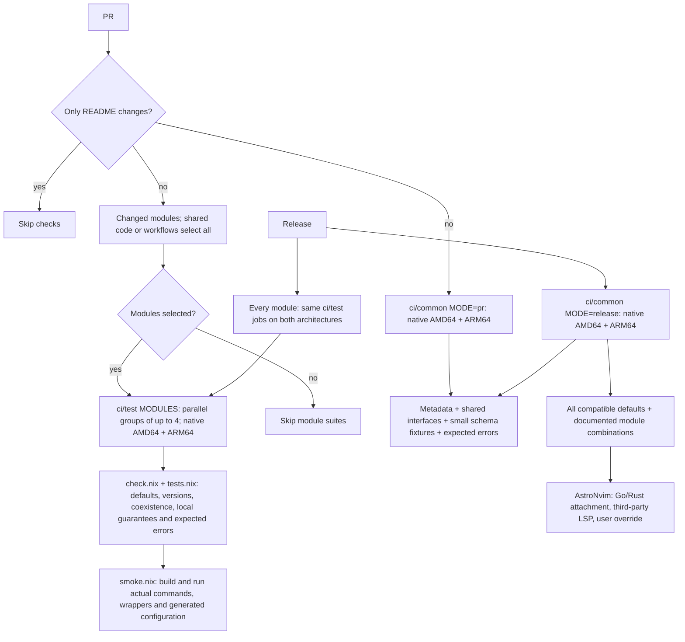

# LimaNix modules

[](LICENSE)

<p align="center">
  
</p>

The NixOS module catalog for [LimaNix](https://github.com/limanix/client).
Add language toolchains, Docker, Kubernetes tools, and editors to a VM by name without writing Nix.

[Catalog](guides/catalog.md) |
[Write a module](guides/writing-modules.md) |
[Releases](https://github.com/limanix/modules/releases) |
[Documentation](https://limanix.dev/categories/nixos/index.html)

## Use a module

List selectors in the `[nixos]` table of your `limanix.toml`:

```toml
[nixos]
modules = ["lmx:go", "lmx:docker", "lmx:python-3.12"]
```

Apply the selection with `limanix update --config limanix.toml`, or with `limanix create --config limanix.toml` for a new VM.

- `lmx:NAME` installs the module's default version line, and `lmx:NAME-VERSION` installs a specific one.
- Each directory in [`catalog/`](catalog/) except `_shared` is one module.
  Its README lists the selectors, exact versions, commands, and guarantees.
- `limanix modules list` shows the selectors that your client provides.

The client binary embeds one catalog release and does not download modules.
After a new catalog release, recent client versions are rebuilt with it and published as new builds, such as `v0.0.1+1`.
Install the latest build of your client version to get the updated catalog.
The [release process](https://limanix.dev/releases/index.html) describes the details.

For tools the catalog does not cover, [write your own module](guides/writing-modules.md) and import it with `limanix modules add`.

## Find the right guide

| Topic                                                            | Guide                                        |
|------------------------------------------------------------------|----------------------------------------------|
| Available modules, version lines, and several versions in one VM | [Catalog](guides/catalog.md)                 |
| NixOS modules, how settings combine, package pins, and trust     | [Concepts](guides/concepts.md)               |
| Writing, combining, and contributing a module                    | [Write a module](guides/writing-modules.md)  |
| Catalog ownership, capabilities, compatibility, and required checks | [Catalog contract](guides/catalog-contract.md) |
| Evaluation errors, build failures, services, and catalog checks  | [Troubleshooting](guides/troubleshooting.md) |

The guides and every module README are also published on the [documentation site](https://limanix.dev/categories/nixos/index.html).

## Repository layout

| Path                      | Contents                                                                                       |
|---------------------------|------------------------------------------------------------------------------------------------|
| `catalog/NAME/`           | One module: entry point, metadata, README, configuration checks, and applicable local and smoke tests |
| `checks/`                 | Shared module runner, minimal common checks, and complete catalog integration checks                 |
| `flake.nix`, `flake.lock` | The NixOS release and the base Nixpkgs revision                                                |
| `guides/`                 | The guides listed above                                                                        |
| `scripts/`                | Documentation preparation, the check runner, and the Nixpkgs update summary                    |

## Develop

Install [Task](https://taskfile.dev) 3.53.1 or newer and Docker with a running engine.
Nix runs in a container; you do not need a local Nix installation.

```console
task --yes ci/nixos-fmt ci/nixos-lint ci/test
task --yes ci/common MODE=release
```

See [Taskfile.yml](Taskfile.yml) for the full task list.

`ci/test` runs all module suites on the container's native Linux architecture.
Pass space-separated module directory names to select a subset:

```console
task --yes ci/test MODULES="go rust"
task --yes ci/common
task --yes ci/common MODE=release
```

Each selected module shares prepared configurations between evaluation and smoke in one evaluator and reuses the container's Nix store.
Version commands run for each supported line; module-wide coexistence and provider overrides run once per module.
Runtime profiles use the selected module’s package contributions with the NixOS profile builder, without building the unchanged base system packages.
The runner bounds parallel module batches and realises each distinct smoke derivation once per module.
Within each CI job, modules run one at a time so their evaluator memory is released between modules.
`ci/common` runs the minimal PR set: catalog metadata, shared interfaces, small schema fixtures, and expected diagnostics.
`ci/common MODE=release` also evaluates all compatible defaults and documented module integrations, then runs the three AstroNvim LSP integration scenarios.



PR checks select changed module directories and run parallel groups of at most four modules on native AMD64 and ARM64 runners.
Changes to workflows, the shared interface, shared Nix code, the Nixpkgs pin, or the test runner select every module.
README-only changes do not run tests.
The minimal common set runs alongside the selected modules.
Release validation runs all module suites and the deep common set in parallel on both architectures before documentation and publication.
CI restores source and binary caches separately for each architecture and saves completed builds even when a later check fails.
A manual `PR flow` run selects every module and prepares the caches.
The first cache preparation can compile pinned dependencies that are absent from the public Nix cache.
The binary cache includes the runtime dependencies of locally built results; Nix still checks the derivation paths against the current configuration.
Set `NIX_CHECK_JOBS` and `NIX_CHECK_BATCH_SIZE` through `CONTAINER_ENVS` to tune evaluator concurrency and memory use.
These checks do not boot the complete Lima VM.
Run a changed module's documented commands in a VM as well.

To contribute a module, follow [Add to the catalog](guides/writing-modules.md#add-to-the-catalog) and the [contribution guide](https://github.com/limanix/.github/blob/main/CONTRIBUTING.md).

## Release

A catalog release is an integer tag, such as `v2`, on a commit in `main`.
The release workflow publishes a GitHub release with the documentation archive and triggers the client rebuilds described in [Use a module](#use-a-module).
