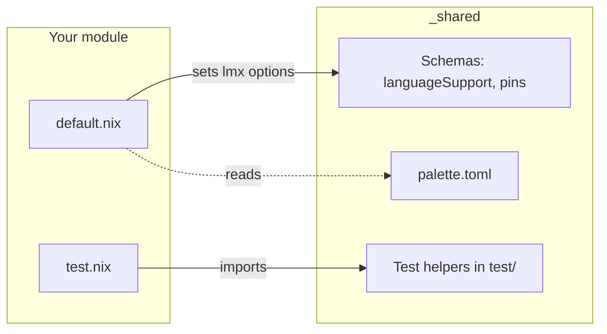
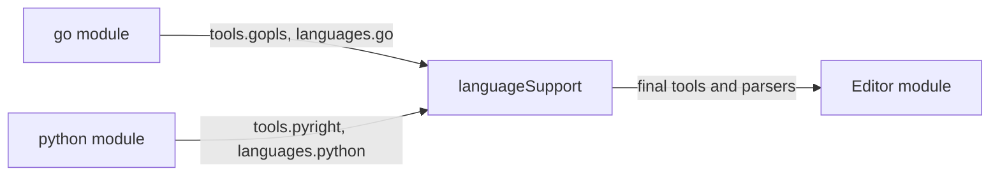

# Shared helpers

`_shared` is the toolbox for catalog module authors: two option schemas that let
modules exchange data, helpers for `test.nix` and common data. It knows no
module names. Your module's checks and policy stay in your module.



Every evaluated system loads the root `*.nix` schemas; `test.nix` is the shared
layer's own test export. Everything else is used only through an explicit
import.

## Find what you need

| I want to | Use |
| -- | -- |
| Check that my module installs a package or sets an option | [`test/helpers.nix`](#check-a-configuration) |
| Check each version line of my module | [`test/lines.nix`](#test-version-lines) |
| Check which line's executable a command runs | [`test/profile-commands.nix`](#check-profile-commands) |
| Take packages from another Nixpkgs revision | [`lmx.pins` and `pinned`](#use-another-nixpkgs-revision) |
| Offer a language server or parsers to editors | [`languageSupport`](#share-language-tools) |
| Prove activation in a NixOS VM | [`test/platform.nix`](#write-a-vm-test) |
| Use the catalog's theme colors | [`palette.toml`](#theme-colors) |
| Drive a terminal program or a language server in `run` | [Process helpers](#drive-processes) |

## Check a configuration

[test/helpers.nix](test/helpers.nix) evaluates public entry points and checks
the result:

```nix
{ evalSystem, pkgs, lib }:
let
  helpers = import ../_shared/test/helpers.nix { inherit evalSystem pkgs lib; };
  configuration = helpers.evaluate [ ./default.nix ];
in
{
  eval.package = helpers.installed configuration pkgs.gh;
  run.commands = import ./test/run.nix {
    inherit pkgs;
    profile = helpers.profileFor configuration;
  };
}
```

| Helper | Result |
| -- | -- |
| `evaluate modules` | Configuration record `{ config; pkgs; lib; }` |
| `installed configuration package` | `true` when `systemPackages` contains the package |
| `installedAsDeclared configuration package` | The same, with the package's declared priority |
| `selectedPackage configuration package` | `true` when the package beats others with the same name |
| `packagePriority package` | The package's priority; `5` by default |
| `profileFor configuration` | The system profile for `run` checks |
| `verify label value configuration` | `true`, or an error naming `label` when `value` is not `true` |

A profile is the evaluated `config.system.path`. Running it proves commands, not
activation.

## Test version lines

For a module with `versions` in `module.toml`, [test/lines.nix](test/lines.nix)
evaluates each line's public entry and calls your callbacks:

```nix
lineTests = import ../_shared/test/lines.nix {
  inherit evalSystem pkgs lib;
  moduleDirectory = ./.;
  checkLine = { line, configuration }: import ./test/check.nix { inherit line configuration; };
  runLine = { line, configuration }: import ./test/smoke.nix { inherit line configuration; };
};
```

`checkLine` returns a Boolean; `runLine` is optional and returns a derivation.
Export `inherit (lineTests) eval run;` to get `eval."line-<line>"` and
`run."commands-<line>"`. The helper checks lines one by one. Whether several
lines work together is your module's decision: export your own `eval.allLines`
or an expected failure such as `fails.twoLines`.

<details>
<summary>Other results and laziness</summary>

| Result | Value |
| -- | -- |
| `lines` | Declared lines in numeric order, for example `1.9`, `1.10` |
| `metadata` | Parsed `module.toml` |
| `configurations.<line>` | Configuration record for `versions/<line>.nix` |
| `defaultConfiguration` | Configuration record for `default.nix` |
| `allConfiguration` | Configuration record importing every line |

Reading `lines` or `metadata` evaluates no system. Each configuration is
evaluated once and shared by the callbacks that use it.

</details>

## Check profile commands

When several lines install the same command,
[test/profile-commands.nix](test/profile-commands.nix) checks which executable
the profile resolves to:

```nix
run.newestCommand = import ../_shared/test/profile-commands.nix {
  inherit pkgs;
  profile = helpers.profileFor lineTests.allConfiguration;
  expectedCommands.helm = "${newestHelm}/bin/helm";
};
```

> [!TIP]
>
> The platform sorts `systemPackages` by store path and then priority, so import
> order never decides a collision. Give colliding commands explicit priorities
> with `lib.setPrio`.

## Use another Nixpkgs revision

Declare the revision and its hash in `lmx.pins`, then read packages from the
`pinned` module argument:

```nix
{ pinned, ... }:
{
  lmx.pins."<revision>" = "<sha256>";
  environment.systemPackages = [ pinned."<revision>".go_1_22 ];
}
```

- Write the hash as a plain constant, without `mkDefault` or `mkForce`. Modules
  that declare the same revision with the same hash agree; different hashes
  fail.
- Use `pinned` only in configuration values, never in `imports` or option
  declarations.
- An unfree package needs its name in `nixpkgs.config.allowUnfreePackages`;
  pinned package sets follow that list.

<details>
<summary>How pinned package sets are built</summary>

Each revision is imported lazily, once per evaluated system, for the system's
platform and without overlays. An unused revision is never downloaded. The
unfree check compares names with the pinned source's own `lib.getName`. A shared
source does not guarantee a binary-cache hit; local builds follow the
[local-build policy](../../guides/catalog-contract.md#local-builds-and-runtime).

</details>

## Share language tools

Language modules publish their tools and parsers; editor modules read the final
result:



A provider declares a complete tool record. Its module computes `rank` as the
number of declared releases older than the selected release; newer releases get
a larger rank and a lower, stronger `mkOverride` priority:

```nix
lmx.capabilities.languageSupport = {
  languages.go.parsers = [ "go" "gomod" ];
  tools.gopls = lib.mkOverride (1000 - rank) {
    package = tools.gopls;
    command = "${tools.gopls}/bin/gopls";
    languages = [ "go" ];
  };
};
```

- A tool record is replaced as a whole: the strongest priority wins with all its
  fields. Use `lib.mkOverride (1000 - rank)` with `0 <= rank < 100` so a newer
  line wins. A user's ordinary definition or `mkForce` still overrides it.
- Equal records at the same priority agree; different records fail evaluation.
- The provider installs the winning `package`. A consumer maps `command` and
  `args` into its own settings.
- Parser lists from all modules add up without duplicates and need no tool.

<details>
<summary>Fields</summary>

| Field | Type |
| -- | -- |
| `tools.<identity>.package` | Package; required |
| `tools.<identity>.command` | Executable path; required |
| `tools.<identity>.args` | List of strings; default `[]` |
| `tools.<identity>.languages` | List of language names; default `[]` |
| `languages.<language>.parsers` | List of parser names; default `[]` |

The tool identity names the tool itself, such as `gopls`, not the module that
provides it.

</details>

## Write a VM test

[test/platform.nix](test/platform.nix) is the platform for a `runNixOSTest`
node. Import it with your module's public entry:

```nix
pkgs.testers.runNixOSTest {
  name = "zsh-activation";
  nodes.machine.imports = [
    (import ../../_shared/test/platform.nix { userName = "tester"; })
    ../default.nix
  ];
  testScript = ''
    machine.wait_for_unit("multi-user.target")
  '';
}
```

The platform adds `interface.nix`, the shared schemas and a user account with
UID 1000. The account is named `dev` with home `/home/<name>` unless you pass
`userName` or `userHome`; it follows the final `limanix.user` settings, such as
a shell chosen by your module.

- Import it only into VM nodes. `evalSystem` already contains this platform.
- Choose the account through the parameters, not by redefining the read-only
  `limanix.user.name` or `limanix.user.home`.
- VM tests run locally on Linux with KVM; see
  [Automation](../../guides/automation.md#run-locally).

## Drive processes

[test/terminal.py](test/terminal.py) runs a command in a pseudo-terminal with
deadlines and bounded output. Add `PYTHONPATH = ../../_shared/test;` to the
`runCommand` environment:

```python
from terminal import TerminalProcess

with TerminalProcess([program], env=environment) as process:
    process.until(lambda: b"ready" in process.output, timeout=5)
    process.send(b"q")
```

[test/lsp-smoke.py](test/lsp-smoke.py) starts a language server and checks that
it initializes and shuts down:

```sh
python ${../../_shared/test/lsp-smoke.py} --timeout 10 ${profile}/bin/gopls
```

## Theme colors

[palette.toml](palette.toml) holds the Catppuccin Mocha colors:

```nix
inherit (builtins.fromTOML (builtins.readFile ../_shared/palette.toml)) mocha;
# mocha.blue == "#89b4fa"
```

## Change `_shared`

> [!IMPORTANT]
>
> Shared code never names a module, chooses its lines or rebuilds its test
> scenarios. A change under `_shared` makes CI check the whole catalog.

Add code here only when several modules need it without module policy. A root
`*.nix` file is an option schema that every system loads; pure functions belong
in `lib/` and test helpers in `test/`. Each promise below needs an exact key in
`_shared/test.nix`.

## Guarantees

`Checked by` names exports of `_shared/test.nix`. Fake-process checks cover the
helpers; module checks cover real tools. Pin checks do not download a source.

| Guarantee | Checked by |
| -- | -- |
| Empty language schemas contribute no tools or languages | `eval.emptyCapabilities` |
| Optional tool defaults normalize before equality comparison | `eval.normalizedDeclarations`, `eval.equalDeclarations` |
| Tool records select atomically, including omitted optional fields | `eval.atomicDeclaration` |
| Parser contributions add and deduplicate independently of tools | `eval.parserContributions` |
| Unequal command, argument or language declarations fail | `fails.conflictingCommands`, `fails.conflictingArgs`, `fails.conflictingLanguages` |
| Required tool fields cannot be omitted | `fails.missingToolCommand`, `fails.missingToolPackage` |
| Empty and unused pin values stay lazy in the actual loader | `eval.emptyPins`, `eval.lazyPins` |
| Equal ordinary pin hashes agree; different ordinary hashes fail | `eval.pinDeclarations`, `fails.conflictingPins` |
| Empty registry reaches the actual `pinned` module argument | `eval.pinWiring` |
| VM platform loads public schemas, excludes the test export and follows the configured account | `eval.vmPlatform` |
| Package ordering preserves values, context, duplicates and replacement semantics | `eval.canonicalPackages`, `eval.packageValues` |
| Canonical profile retains the explicit package-priority winner | `run.packagePriority` |
| Lines sort numerically and callbacks receive their public entry records | `eval.numericLines`, `eval.lineCallbacks` |
| Runtime callbacks produce named derivations without automatic realization | `eval.lineRuntimeRecipes` |
| Metadata inspection stays lazy; default and all-line fixtures are separate | `eval.lazyLineFixtures`, `eval.separateLineFixtures` |
| A non-Boolean line predicate fails | `eval.strictLinePredicate` |
| PTY deadlines, fragmented I/O, bounded output and cleanup work | `run.terminal` |
| JSON-RPC framing, unrelated messages, failure diagnostics and cleanup work | `run.protocol` |
