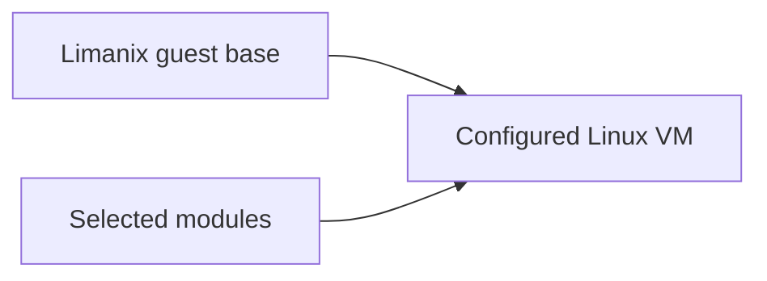

# NixOS modules

Use modules to describe the tools and services you want inside a Limanix VM.
Start with the catalog, then add your own configuration when a project needs more.
You do not need prior NixOS experience to follow this guide.

## Choose your starting point

| I want to…                                       | Start here                                    |
|--------------------------------------------------|-----------------------------------------------|
| Understand what a module does                    | [The module model](concepts.md)               |
| Install a language toolchain or Docker           | [Use catalog modules](using-modules.md)       |
| Add packages or a service of my own              | [Write your first module](writing-modules.md) |
| Share a module with configurable settings        | [Build reusable modules](reusable-modules.md) |
| Look up selectors, defaults, and installed tools | [Catalog reference](catalog.md)               |
| Add a module to this repository                  | [Contribute to the catalog](contributing.md)  |
| Understand a failed import or update             | [Troubleshooting](troubleshooting.md)         |

**New to NixOS?** Read the module model, try a catalog module, then work through the custom-module tutorial. 
Each step builds on the previous one.

## Where modules fit



| Configuration  | Responsibility                                                                         | Example                                                 |
|----------------|----------------------------------------------------------------------------------------|---------------------------------------------------------|
| `limanix.toml` | VM resources, mounts, user settings, environment, firewall ports, and module selection | Select `lmx:python-3.14`                                |
| NixOS modules  | Packages and system services inside the guest                                          | Install Python or enable Docker                         |
| Project files  | Application source and project dependencies                                            | `go.mod`, `package.json`, or a Python requirements file |

Selecting a module does not install its tools on your Mac. 
Run those tools inside the VM with `limanix shell`.

## Two sources, one configuration

| Source          | Selector                 | How it becomes available                                  |
|-----------------|--------------------------|-----------------------------------------------------------|
| Bundled catalog | `lmx:git`, `lmx:go-1.27` | Included in the installed Limanix client                  |
| Your own module | `third-party:dev-tools`  | Copied into the local registry with `limanix modules add` |

Both are NixOS modules. 
The prefix tells Limanix where to find their source.
Here, **third-party means locally imported**: it can be a module you wrote yourself.

These pages live with the module catalog, ready for inclusion alongside the matching client's documentation on the shared site. 
The [catalog reference](catalog.md) describes this source revision; `limanix modules list` shows what your installed client can use.

```{toctree}
:hidden:
:maxdepth: 1

concepts
using-modules
writing-modules
reusable-modules
catalog
contributing
troubleshooting
```
