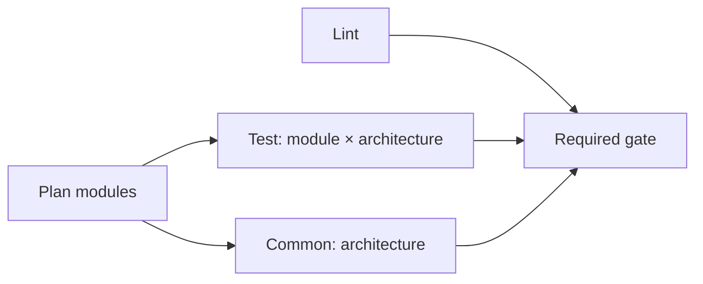

# Repository automation

Automation consumes the public module contract. It does not inspect private
package maps or choose module-specific test scenarios.

| Layer                | Responsibility                                                                      |
| -------------------- | ----------------------------------------------------------------------------------- |
| Workflow             | Events, change selection, native matrices, cache restore/save and the required gate |
| Taskfile             | The same explicit commands for local use and CI                                     |
| `plan_checks.py`     | Git diff to modules, public-import consumers and the common flag                    |
| `run_checks.sh`      | Contract validation, stage execution and build permission                           |
| `cache_nix_build.sh` | Post-build hook exporting local builds with their runtime closure                   |
| `prune_nix_cache.sh` | Removal of cached builds the last run did not need                                  |

Module scenarios stay in each module's `test.nix` and private `test/` files. The
runner implements their common calling and result contract.

## PR flow

Pull requests and pushes to `main` use the same check flow:



| Job      | Work                                                   | Selection                                                      |
| -------- | ------------------------------------------------------ | -------------------------------------------------------------- |
| `plan`   | Git diff and public dependency discovery               | Every run                                                      |
| `lint`   | Nixfmt, Statix, Deadnix and source Markdown formatting | Every run                                                      |
| `test`   | One module: `eval`, then `run`                         | Changed modules and their consumers, on x86 and ARM            |
| `common` | Shared and platform `eval`/`run`                       | Evaluation input or Task configuration changes, on x86 and ARM |
| `gate`   | Require all selected jobs to succeed                   | Every run                                                      |

There is no barrier between all module evaluations and all native runs. Each
module job completes its own cycle. A new push cancels the previous run of the
same pull request. Runs on `main` are never cancelled, so each one tests and
caches its own changes.

The full catalog runs only when a change affects every module evaluation:

| Changed path                  | Modules                                     | Common |
| ----------------------------- | ------------------------------------------- | ------ |
| `catalog/<module>/**`         | That module and its public-import consumers | No     |
| An evaluation input           | Full catalog                                | Yes    |
| `Taskfile.yml`, `.taskrc.yml` | None                                        | Yes    |
| Any other file                | None                                        | No     |

Evaluation inputs are `catalog/_shared/**`, `interface.nix`, `flake.nix`,
`flake.lock`, `checks/**`, `scripts/run_checks.sh` and
`.github/workflows/nix-tests.yml`.

Lint runs for every change. Editing an existing `README.md` in a module or in
`_shared` selects no tests. Adding or removing one changes module structure and
counts as a module change.

The planner discovers module directories. Contract validation belongs to the
harness. Dependency discovery evaluates public default and version entry points
for both architectures. It does not run module tests or infer imports by reading
private files. If discovery is unavailable or a changed module was removed, the
planner selects the full catalog.

## Run locally

From the repository root, with Task and Docker:

```console
task --yes ci/lint
task --yes ci/test/modules MODULES=dev-tools
task --yes ci/test/common
```

`dev-tools` is the illustrative entry in [Write a module](writing-modules.md);
replace it with a module present in your checkout. `MODULES` accepts
space-separated directory names. Omitting it selects the full catalog. Selected
modules run one after another, each in its own evaluator. The common cycle runs
shared, then platform checks.

`ci/test/modules` defaults to `MODE=check`. `ci/test/common` defaults to
`SUITE=common` and `MODE=check`. Select an individual suite or stage when
diagnosing a failure or running release checks:

| Task                                          | Result                                                                              |
| --------------------------------------------- | ----------------------------------------------------------------------------------- |
| `ci/test/modules MODE=eval MODULES=dev-tools` | Metadata, entry points, recommendation, Boolean assertions and expected diagnostics |
| `ci/test/modules MODE=run MODULES=dev-tools`  | Native execution after the local-build dry-run                                      |
| `ci/test/common SUITE=shared MODE=eval`       | Shared schemas and test helpers                                                     |
| `ci/test/common SUITE=platform MODE=run`      | Native builder permissions                                                          |

On native Linux, the same runner is available directly:

```console
bash scripts/run_checks.sh module check dev-tools
bash scripts/run_checks.sh common check
```

A module's activation check needs native Linux and an accessible `/dev/kvm`:

```console
task --yes ci/test/modules MODE=vm MODULES=dev-tools CONTAINER_RUN_ARGS=--device=/dev/kvm
```

A container without KVM cannot prove activation.

Discovery commands:

```console
task --yes ci/plan/dependencies SYSTEM=aarch64-linux OUTPUT=build/dependencies.json
task --yes ci/plan/vm-modules SYSTEM=aarch64-linux OUTPUT=build/vm-modules.json
```

`SYSTEM` also accepts `x86_64-linux`; omitted values use the native runner.

## Caches

Each native job restores one cache for its target (a module or the common suite)
and architecture. It holds downloaded sources in `.cache/nix` and the target's
own local builds in `.cache/nix-binary`. Successful runs on `main`, pushes and
manual runs, save it; pull requests and tags only restore it. Cache failures do
not replace check results.

The key combines the architecture, the target and a hash of `flake.lock`,
`flake.nix`, `interface.nix`, `catalog/**`, `checks/**` and the three cache and
runner scripts. Restore tries the exact key first, then the newest cache for the
same architecture and target. Parallel jobs with the same key do not merge their
archives. An existing exact archive is read without adding another export.

On publishing runs, a post-build hook copies every locally built output into
`.cache/nix-binary`. Nix requires a binary cache to hold the references of its
paths, so the copy includes the output's runtime closure, such as glibc;
build-only tools such as compilers stay out. There is no size limit. Instead,
the runner lists the build closure of the checks it ran, and the job removes
every cached path outside that list before saving. Builds of older versions
therefore leave the cache, which holds only what the target's current version
builds locally, with its runtime closure. The step summary reports the size.
Saved narinfo lookups are removed as well, so the next run sees the cache as
saved.

The module's `builds` export permits exact artifacts. The harness includes
permissions from selected modules and their default/individual-line public-entry
dependencies. A test-only import does not extend this set or schedule another
module's checks. An uncached dependency outside the
[local-build policy](catalog-contract.md#local-builds-and-runtime) fails the
dry-run. Restoring a cache does not expand build permission.

## Duration and evidence

The PR flow targets ten minutes on its critical path with a prepared cache.
Per-module targets are in
[Cost and reports](catalog-contract.md#cost-and-reports). Targets are measured,
not enforced: the runner and the jobs set no time limits, so a slow check
finishes and reports its actual duration. Only cache restore and save steps stop
after two minutes, because a stuck transfer produces no check result. A hung job
runs until GitHub's default job limit unless cancelled. CI uses one build job
and all available cores for that build.

Reports identify the suite, stage, architecture, actual duration and result.
Separate new execution from reused results where known. A cache hit or printed
derivation path does not prove a fresh run. Unknown cache state stays unknown.
VM status is passed, failed or not run, with the reason for unavailable KVM.

## Other automation

`build_docs.py` prepares source Markdown for the documentation site.
`nixpkgs/update` remains an explicit local command. The release flow runs the
same `check` cycle for every module and the common suite, then the modules' VM
tests.

Each module declares additional revisions in `lmx.pins`. Shared
`_module.args.pinned` resolves one lazy package set per revision within that
system, using its architecture and unfree policy. Automation has no named-module
snapshot registry.
