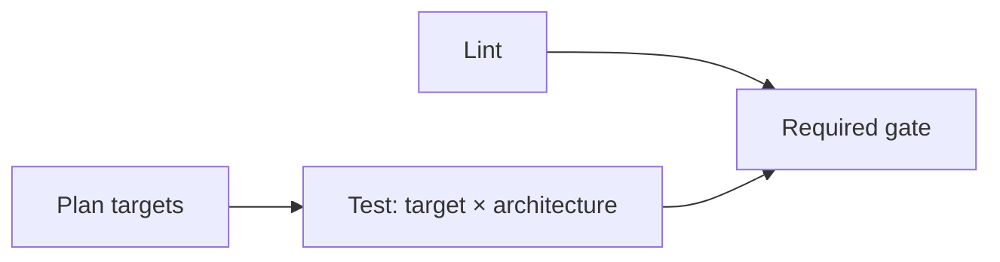

# Repository automation

Automation consumes the public module contract. It does not inspect private
package maps or choose module-specific test scenarios.

| Layer | Responsibility |
| -- | -- |
| Workflow | Events, change selection, native matrices, cache restore/save and the required gate |
| Taskfile | The same explicit commands for local use and CI |
| `run_checks.sh` | Contract validation, stage execution and build permission |
| `cache_nix_build.sh` | Post-build hook exporting local builds with their runtime closure |
| `prune_nix_cache.sh` | Removal of cached builds the last run did not need |

Module scenarios stay in each module's `test.nix` and private `test/` files. The
runner implements their common calling and result contract.

## PR flow

Pull requests to `main` run the check flow. Pushes to `main` and tags run no
tests: a merged change was checked in its pull request.



| Job | Work | Selection |
| -- | -- | -- |
| `plan` | Git diff to test targets | Every run |
| `lint` | Nixfmt, Statix, Deadnix and source Markdown formatting | Every run |
| `test` | One target: `eval`, then `run` | Selected targets, on x86 and ARM |
| `gate` | Require all selected jobs to succeed | Every run |

A target is a catalog module or `common`, the shared and platform suites; the
name `common` is therefore reserved. There is no barrier between all module
evaluations and all native runs. Each target job completes its own cycle. A new
push cancels the previous run of the same pull request.

The plan compares the pull request's merge commit with its base. The full
catalog runs only when a change affects every module evaluation:

| Changed path | Modules | Common |
| -- | -- | -- |
| `catalog/<module>/**` | That module | No |
| An evaluation input | Full catalog | Yes |
| `Taskfile.yml`, `.taskrc.yml`, `.github/workflows/pr.yml`, the two cache scripts | None | Yes |
| Any other file | None | No |

Evaluation inputs are `catalog/_shared/**`, `interface.nix`, `flake.nix`,
`flake.lock`, `checks/**` and `scripts/run_checks.sh`.

Lint runs for every change. A module's `README.md` belongs to that module: its
job validates the catalog structure, including each page's `## Guarantees`
heading. A removed module selects nothing.

The plan does not add consumers of a changed module. When a change alters a
public entry point that other modules import, run their checks locally or start
the flow manually on the branch: a manual run checks the full catalog and the
common suite.

## Run locally

From the repository root, with Task and Docker:

```console
task --yes ci/lint
task --yes ci/test/modules MODULES=dev-tools
task --yes ci/test/common
```

`dev-tools` is the illustrative entry in [Write a module](writing-modules.md);
replace it with a module present in your checkout. `MODULES` accepts
space-separated directory names. Omitting it selects the full catalog. Selected
modules run one after another, each in its own evaluator. `MODE=check` evaluates
both stages in that one evaluator, so each configuration is evaluated once; it
then checks expected failures and builds the `run` exports. The common cycle
runs shared, then platform checks.

`ci/test/modules` defaults to `MODE=check`. `ci/test/common` defaults to
`SUITE=common` and `MODE=check`; `MODE=eval` and `MODE=run` need `SUITE=shared`
or `SUITE=platform`. Select an individual suite or stage when diagnosing a
failure:

| Task | Result |
| -- | -- |
| `ci/test/modules MODE=eval MODULES=dev-tools` | Metadata, entry points, recommendation, Boolean assertions and expected diagnostics |
| `ci/test/modules MODE=run MODULES=dev-tools` | Native execution after the local-build dry-run |
| `ci/test/common SUITE=shared MODE=eval` | Shared schemas and test helpers |
| `ci/test/common SUITE=platform MODE=run` | Native builder permissions |

On native Linux, the same runner is available directly:

```console
bash scripts/run_checks.sh module check dev-tools
bash scripts/run_checks.sh common check
```

A manual activation check needs native Linux and `/dev/kvm` access for the Nix
build user. CI has no KVM runners, so activation checks run only locally:

```console
task --yes ci/test/modules MODE=vm MODULES=dev-tools CONTAINER_RUN_ARGS=--device=/dev/kvm
```

A container without KVM cannot prove activation.

## Caches

Each native job restores one cache for its target (a module or the common suite)
and architecture. It holds downloaded sources in `.cache/nix` and the target's
own local builds in `.cache/nix-binary`. A successful job saves it when no
archive with the exact key exists. GitHub scopes a cache saved in a pull request
to that pull request: its later pushes and reruns restore it, while a new pull
request starts without one and rebuilds what its checks need. Cache failures do
not replace check results.

The key combines the architecture, the target and a hash of `flake.lock`,
`flake.nix`, `interface.nix`, `catalog/_shared/**`, the target's own
`catalog/<module>/**`, `checks/**` and the three cache and runner scripts. A
push that changes other modules keeps the key, so the job reuses its archive and
saves nothing. Restore tries the exact key first, then the newest cache for the
same architecture and target. A change in an imported module does not change the
key; Nix builds what the archive lacks, and the next change to the target saves
a new one. Parallel jobs with the same key do not merge their archives. An
existing exact archive is read without adding another export.

Without an exact hit, a post-build hook copies every locally built output into
`.cache/nix-binary`. Nix requires a binary cache to hold the references of its
paths, so the copy includes the output's runtime closure, such as glibc;
build-only tools such as compilers stay out. There is no size limit. Instead,
the runner lists the build closure of the checks it ran, and the job removes
every cached path outside that list before saving. Builds of older versions
therefore leave the cache, which holds only what the target's current version
builds locally, with its runtime closure. Before saving, the job also deletes
Nix's local record of binary-cache lookups, so the next run does not reuse stale
answers about pruned or newly added paths.

The module's `builds` export permits exact artifacts. The harness includes
permissions from selected modules and their default/individual-line public-entry
dependencies. A test-only import does not extend this set or schedule another
module's checks. An uncached dependency outside the
[local-build policy](catalog-contract.md#local-builds-and-runtime) fails the
dry-run. Restoring a cache does not expand build permission.

## Duration and evidence

[Cost and reports](catalog-contract.md#cost-and-reports) sets the duration
targets for the PR flow and each module, and what a report records. Targets are
measured, not enforced: the runner and the jobs set no time limits, so a slow
check finishes and reports its actual duration. Only cache transfers stop after
two minutes, because a stuck transfer produces no check result: the restore and
save steps, and each post-build copy into the cache. A hung job runs until
GitHub's default job limit unless cancelled. CI uses one build job and all
available cores for that build.

The runner prints the system before it starts, a `PASS` line with the duration
of each completed stage and a `RESULT` line with the suite, mode, status and
total duration at the end. A cache hit or printed derivation path does not prove
a fresh run. VM status is passed, failed or not run, with the reason for
unavailable KVM.

## Other automation

A tag `v<N>` on a commit of `main` starts the release flow. It runs no tests:
the tagged commit passed its pull request. The flow checks the tag, prepares the
documentation sources with `build_docs.py`, publishes the GitHub release with
that archive and notifies the client repository.

PR and release workflows do not run VM tests. Activation checks remain available
for manual execution on native Linux with KVM; their results are separate from
CI results.

`nixpkgs/update` is an explicit local command and changes only the base revision
in `flake.lock`. Additional revisions belong to the modules that declare them in
`lmx.pins` and change only when those modules edit them. Shared
`_module.args.pinned` resolves one lazy package set per revision within that
system, using its architecture and unfree policy.
