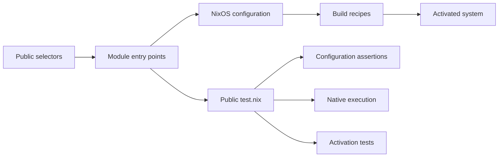

# Catalog contract

This document defines the module contract, revision 3.

## NixOS foundation

A module declares options, assigns configuration and imports other modules.
NixOS combines these definitions into one system. Evaluation, building and
activation are separate operations.



## Ownership

| Component | Owns | Uses from other components |
| -- | -- | -- |
| Module | Its packages, pins, settings, adapters, tests and README | Public entry points, options and capabilities |
| `_shared` | Generic schemas, data and test helpers | Explicit arguments; no named module policy |
| Platform | Base Nixpkgs, account identity and public schemas | Module entry points |
| Harness | Discovery, contract validation, scheduling and results | Public metadata and `test.nix` exports |

An aggregate is also a module. Its component choices and integration scenarios
stay in its directory. External code does not read another module's private
package map, tests or `lmx.internal.<name>` values.

## Catalog layout and imports

```text
catalog/<name>/
├── module.toml          discovery metadata
├── default.nix          default public entry point
├── versions/<line>.nix  one public entry point per declared line
├── test.nix             public test export
├── test/                private test code and fixtures
├── README.md            usage, guarantees and corner cases
└── ...                  private implementation
```

`module.toml`, entry points, documented options and `test.nix` are the machine
interface. The README is the public human interface. Other filenames are
private; a harness must not depend on their names or layout.

### Discovery metadata

| Field | Rule |
| -- | -- |
| `description` | Required nonempty string |
| `versions` | Optional list of unique numeric strings |
| `default` | Required member of nonempty `versions`; absent otherwise |
| Unknown field | Error |

A module name matches `[a-z][a-z0-9]*(-[a-z][a-z0-9]*)*`; each segment starts
with a letter. A line matches `[0-9]+(\.[0-9]+)*`. Both are at most 63
characters. `_shared`, `internal`, `capabilities` and `pins` are reserved names.
Each declared line has its entry point under `versions/`.

## Selectors and system assembly

`lmx:<name>` imports `default.nix`; `lmx:<name>-<line>` imports the matching
`versions/<line>.nix`. Unknown modules and lines are errors.

A conforming platform must:

1. Import `interface.nix` and root `_shared/*.nix`, excluding
   `_shared/test.nix`.
1. Set `limanix.user.name` and `limanix.user.home`.
1. Import the selected public entry points.
1. Evaluate and build the system, preserving evaluation diagnostics.

The platform does not supply a preconstructed `nixpkgs.pkgs`. NixOS creates the
base package set from that system's effective `nixpkgs.config`, including unfree
declarations.

After option merging, the platform sorts `environment.systemPackages` by
`toString package`, then by ascending `meta.priority` for equal paths. Strings
and records without a priority use `lib.meta.defaultPriority`. It preserves
values, string context, metadata and duplicates, including the result of
`mkForce`. Distinct packages that provide the same command need an explicit
package priority; import order and `mkBefore` do not define their winner.

## Option classes and availability

| Namespace | Declares | Reads and writes |
| -- | -- | -- |
| `limanix.*` | `interface.nix` | Platform identity; module shell and session declarations |
| `lmx.<name>.*` | The named module | Documented public settings |
| `lmx.capabilities.<area>.*` | Root `_shared/<area>.nix` | Providers and consumers |
| `lmx.pins` | `_shared/pins.nix` | Modules declare their revisions; shared infrastructure resolves them |
| `lmx.internal.<name>.*` | The named module | That module only |
| Standard NixOS options | Nixpkgs | Normal NixOS definitions |

`limanix.session.command` is the absolute path of an executable, or `null` when
no selected module provides sessions. It receives exactly one literal session
name and returns status 64 for an invalid name. Its provider owns the
application behavior. `limanix.session.providers` lists the selectors the client
suggests while the command is `null`; it defaults to `[ "lmx:tmux" ]`.

## Capability providers and consumers

A dependency imports another module's public entry point. NixOS handles repeat
imports of the same file. A capability exchanges typed data without naming its
provider or consumer module.

Every capability schema defines record identity, merge behavior and conflicts.
Document these rules at the start of each root schema. The platform loads the
schema even without providers; consumers can read its empty defaults. An atomic
tool record selects its package, command and arguments from the same
declaration. Different records at the same priority fail under that schema; they
do not merge field by field. Other contributions may combine according to their
schema, such as the additive parser declarations.

Provider recommendations use `lib.mkOverride (1000 - n)`, where `0 <= n < 100`.
An ordinary user definition and `mkForce` take precedence. A provider does not
enable an editor or another consumer merely by declaring its tools.

## Defaults and overrides

Replaceable preferences use option defaults or `lib.mkDefault`. Additive values
follow their option type. A required condition uses a meaningful assertion.
Ordinary NixOS merging, type checks and repeat-import handling are not repeated
as module-specific tests. A module tests its own defaults, wrappers, patches and
integration behavior.

NixOS definition priority and package-file priority are different. Modules that
rank several command providers must keep their declaration and installed command
choices consistent.

## Composition and version selection

For a versioned module, `default.nix` only recommends the metadata's default
line with `lib.mkDefault` and adds no other behavior. An explicit line replaces
that recommendation, including when an aggregate imports the default. The
default and explicit entry points provide the same line's behavior.

Several explicit lines either coexist as documented in the README or fail with a
module-owned assertion. They must not silently discard a selection or choose a
winner through import order. A module that supports coexistence checks its own
aliases and ordinary-command priority.

### Guarantees and version lines

Adding or removing lines and changing `default` require a catalog release.
Removing a line is incompatible: release notes explain the migration and link to
the previous release.

## Package pins and unfree permissions

The base Nixpkgs revision comes from `flake.lock`. A module declares any
additional revision and hash in `lmx.pins`; it consumes
`_module.args.pinned.<revision>` in configuration values. It does not use
`pinned` to choose `imports` or declare `options`, which resolve earlier.

Pins are ordinary constant declarations, without `mkDefault`, `mkOverride` or
`mkForce` around the registry, an entry or a containing definition. Different
ordinary hashes for one revision fail NixOS string merging; equal declarations
agree. The schema does not reject priority overrides separately; using them
breaks this contract.

Within a system, all modules share the same lazy package set for one revision.
Every declared revision uses the same architecture, empty overlays and effective
unfree policy. No selected revision or module package recipe is registered
centrally.

An unfree module declares a constant list through
`nixpkgs.config.allowUnfreePackages`. The base package set applies it; the
shared loader applies it to every pin using that source's `lib.getName`. Unfree
permission and local-build permission are separate. Build this list from
constant package names, without evaluating `pkgs` or `pinned`. Each system
fixture applies its own merged list.

| Shared location | Contents |
| -- | -- |
| Root `*.nix`, except `test.nix` | Always-loaded schemas and infrastructure |
| `test.nix` | Shared checks using the same test ABI, without module metadata or a selector |
| `lib/` | Pure generic functions |
| `test/` | Generic fixtures and test helpers |
| Non-Nix files | Common data such as the palette |

## Required checks for every module

The harness checks metadata and evaluates every public entry point on its own.
For each version line, it compares `system.build.toplevel.drvPath` for
`[default, line]` and `[line, default]` with `[line]`; both must match. This
evaluates system derivations without building them. The module import graph
allows only the owning module's files, root `_shared` schemas and other modules'
public entry points. Ordinary `import` and `readFile` boundaries need review;
that graph cannot see them. Module-specific scenarios stay inside the module.

Public invocation:

```nix
import (moduleDirectory + "/test.nix") { inherit evalSystem pkgs lib; }
```

| Argument | Meaning |
| -- | -- |
| `evalSystem` | List of public NixOS modules to checked `config`; evaluates without building |
| `pkgs`, `lib` | Base packages and library for the native runner |

The harness memoizes one application of a module's `test.nix` within one Nix
evaluation/test context. It does not reimport the export for each line. Separate
phase jobs and expected-error subprocesses evaluate the same public contract in
their own contexts. The shared export has a separate context. `evalSystem`
returns the checked configuration for its supplied module list. Related
assertions should reuse that configuration; the harness may reuse identical
public-entry evaluations.

| Export | Value | Evidence |
| -- | -- | -- |
| `eval` | Required nonempty attribute set; every value is Boolean `true` | Configuration |
| `fails` | Records with a module list and nonempty diagnostic string | The supplied modules fail with that diagnostic |
| `run` | Native derivations | Actual command and application behavior in an isolated fixture |
| `builds` | Exact derivations allowed to build locally | Permission only |
| `vm` | Native `pkgs.testers.runNixOSTest` derivations | Real NixOS activation |

Optional groups default to `{}`. Unknown top-level fields fail. Each `fails`
record contains exactly `modules` (a list of NixOS modules) and `message` (a
nonempty string). A failure case does not pass on a timeout, crash or unrelated
diagnostic. A printed derivation path does not establish execution. Native `run`
fixtures stay offline and do not use a VM or `system.build.toplevel`.

| Group | Names |
| -- | -- |
| `eval` | camelCase promise, `line-<line>`, or `allLines` |
| `fails` | camelCase reason; `twoLines` for incompatible lines |
| `run` | `commands`, `commands-<line>`, or a camelCase feature |
| `builds` | `artifact` or `artifact-<line>` |
| `vm` | `activation` |

Choose the cheapest sufficient level. Configuration assertions do not prove
startup, application settings or service health. Native execution can prepare an
isolated application environment, but does not prove NixOS login or `/etc`
activation. Those promises need a VM test.

## Shared helpers and VM tests

[Shared helpers](../catalog/_shared/README.md) describes the line helper, the
configuration helpers and the VM platform. They remove repetition; the checks
remain the module's own:

- The line helper checks each line separately. The module decides whether lines
  coexist and exports `allLines` or the incompatible-pair failure.
- VM nodes import the shared platform and the module's public entry points.
  Choose another account through its `userName` and `userHome` parameters; do
  not redeclare the read-only account name or home in an extra module.
- VM resources and assertions remain under the module's `test/`. Do not import
  the VM platform into `evalSystem`, where it already exists, and do not pass a
  fourth platform argument to `test.nix`.

## Local builds and runtime

Before realising `run`, the harness checks its dry-run. Local builds are allowed
only for:

1. The selected `run` derivations themselves.
1. Derivations with `preferLocalBuild = true`, including trivial builders and
   system profiles.
1. Exact `drvPath` values declared in `builds`.

The `builds` permission set comes from selected modules and the modules actually
imported by their default and individual version entry points. The harness reads
that public import graph; a dependency used only by a test fixture does not
extend this permission set. Reading a dependency's public `builds` does not
schedule its `eval` or `run`. Permission does not include transitive derivation
inputs. Any other uncached build fails before execution and is reported. A cache
hit does not prove a fresh run; report reuse separately. No native fixture uses
personal host state or provisions external services. VM builds skip the native
runtime dry-run.

## Cost and reports

| Level | When | Target per module |
| -- | -- | -- |
| Structure, entry points, recommendation, `eval`, `fails` | Changed modules on PRs | 2 minutes |
| `run` | Changed modules, both native Linux architectures | 5 minutes with prepared cache |
| `vm` | Manual execution on native Linux with KVM | 15 minutes |

The PR flow runs `eval`, `fails` and `run`; the release flow runs no tests. VM
exports remain part of the module test interface and run manually on native
Linux with KVM. A green CI run does not establish activation; record VM checks
as not run unless a separate execution supplies evidence.

Reuse one default fixture, one per needed line and one for each different
scenario. Fixture counts guide cost; they are not hard limits on correctness.
Each README promise and relevant regression determines the required coverage.

The PR flow targets ten minutes on its critical path with a prepared cache.
Targets are measured, not enforced: checks run without time limits. Reports
identify the suite, stage, architecture, actual duration, cache state, builds
and VM status. They separate newly executed checks from reused results where
known; unknown cache state stays unknown. A cancelled or interrupted run is
incomplete evidence.

The PR flow checks changed modules, not the consumers of their public imports.
Changes to `_shared`, `interface.nix`, the flake or the harness check every
module. Platform `eval` and `run` check the generic harness and base interface,
including its builder permissions. Required compositions belong in their own
module tests.

## README guarantees

A module page explains what is installed, selectors, public settings, several
line behavior, generated files, services, persistent data and corner cases. The
harness requires a `## Guarantees` heading. Its table uses exact existing keys
in `Checked by`, such as `eval.packages`, `run.commands` or `vm.activation`. A
row may list one or more exact keys. Several promises can share a fixture when
it explicitly asserts each property. Corner cases and regressions must relate to
a stated promise.

`builds.*` is not evidence. Private filenames and wildcard keys are not test
exports. Do not add a generic `Tests` section that repeats this ABI.

## Client and catalog compatibility

Each client build bundles one catalog release and is tested with it. An
incompatible change to selector grammar, metadata, public options, capabilities
or the test ABI ships together with the client changes that support it. Private
layout changes and catalog version-line changes need no client change.
