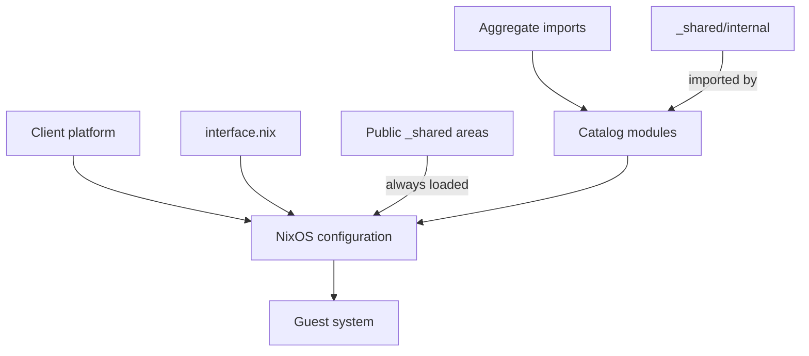
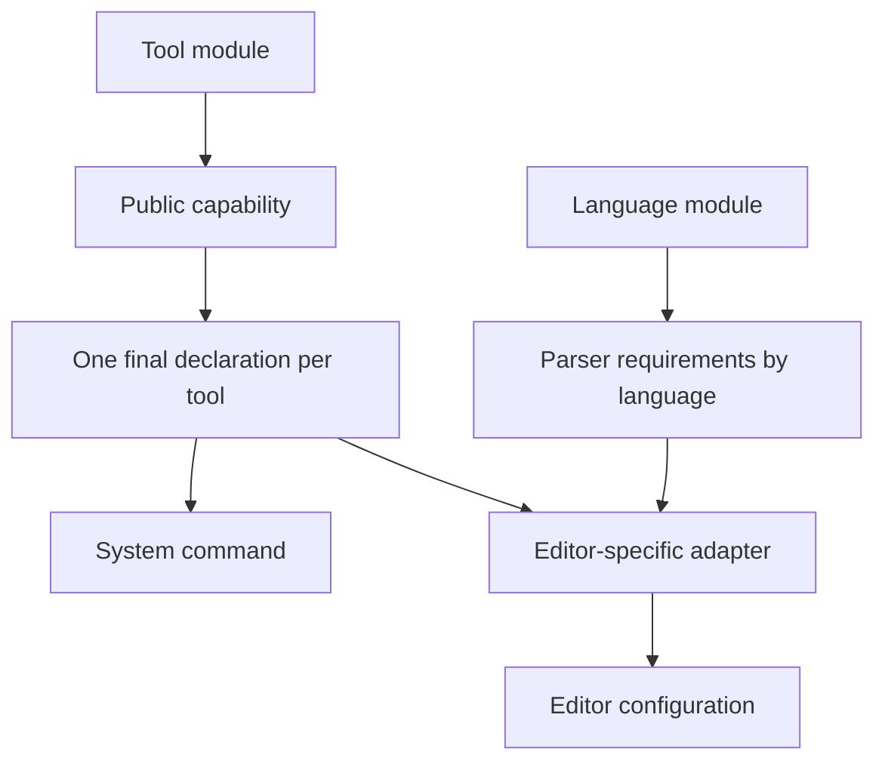
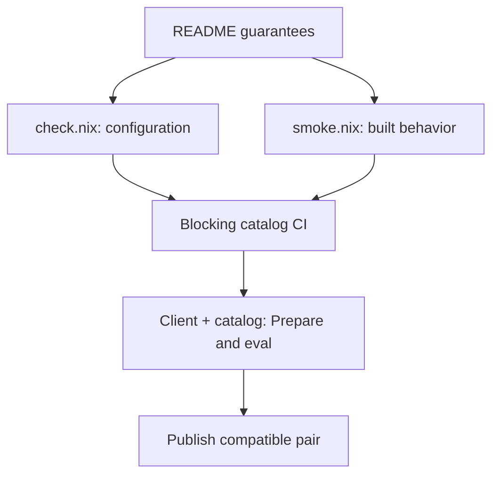

# Catalog contract

This contract applies to every catalog module: packages, languages, services, shells, editors, and aggregates.
New guest software belongs in the catalog.
Client changes are limited to the VM platform, CLI operations and `limanix.toml` settings, the catalog format, or the shared client interface.
Every published client and catalog pair must pass compatibility checks.
This contract changes only through a pull request to this document.
A change affecting the client interface, catalog format, or release pairs requires a coordinated client pull request.

## Ownership

| Part | Owns |
|---|---|
| Client | VM lifecycle, connections, CLI operations, configuration preparation and delivery |
| Client platform base | Boot, disks, Lima/SSH, the development account, and base terminal compatibility |
| Client/catalog contract | The catalog format, public declarations in `interface.nix` and `catalog/_shared/<area>.nix`, and guest operation protocols |
| Catalog module | Its packages, services, program configuration, dependencies, and integrations |
| `_shared/<area>.nix` | Public capability types and declarations; always loaded, with no application activation |
| `_shared/internal/` | Private declarations imported only by catalog modules; no selector or application activation |
| Aggregate | A component list and its imports; component behavior remains in the component modules |



Support for a host terminal, such as its Ghostty terminfo entry, belongs in the platform base and must work without selecting Zsh or tmux.
Program-specific key bindings, plugins, and shell initialization belong in their modules.
The catalog owns the base Nixpkgs pin, while the client owns its Lima dependency and platform configuration.
Changing that pin still requires validation with the client platform.

## Catalog layout and imports

```text
interface.nix                 Public client/catalog option declarations
catalog/
├── _shared/                  Common declarations; no module selector
│   ├── <area>.nix            Public capabilities; always loaded by the client
│   └── internal/             Private declarations; imported by catalog modules
└── <name>/
    ├── default.nix           Selected module entry point
    ├── module.toml           Description and optional version selectors
    ├── check.nix             Required configuration result check
    ├── README.md             Usage and supported guarantees
    ├── versions/             Required for declared version lines
    └── smoke.nix             Required for custom builds or runtime behavior
```

The directory name `_shared` is reserved.
It has no `module.toml` or selector, does not import application modules, and does not install packages or enable services.
Public areas are the `catalog/_shared/<area>.nix` files; private declarations belong under `catalog/_shared/internal/`.
Public `_shared` areas are part of the client/catalog interface.
The client loads them in every generated configuration, like `interface.nix`, and changes to them follow [Client and catalog compatibility](#client-and-catalog-compatibility).
Private declarations are imported only by the catalog modules that use them.
Loading either kind of declaration must not activate its providers or consumers.
All other catalog directories follow the [metadata rules](writing-modules.md#follow-the-metadata-rules).

Import a concrete file, such as `../git/default.nix` for a component or `../_shared/internal/selection.nix` for a private declaration.
Use the same entry point when selecting a component directly and through an aggregate.
The client preserves the source tree; Nix resolves the imports.

Third-party modules keep their source imports inside their own directory.
They use documented public options rather than reaching into the catalog's generated filesystem paths or copying its type declarations.

## Option classes and availability

| Namespace | Declaration owner | Stability and use |
|---|---|---|
| `limanix.*` | Root `interface.nix` | Public contract shared by the client and catalog |
| `lmx.<module>.*` | The named catalog module | Documented user settings for that module |
| `lmx.capabilities.<area>.*` | `catalog/_shared/<area>.nix` | Public client/catalog interface for capabilities, including contributions from third-party modules |
| `lmx.internal.*` | Catalog modules or `catalog/_shared/internal/` | Private catalog coordination; changed together with its consumers |

The names `capabilities` and `internal` are reserved and cannot be catalog module names.
Editor capabilities are public: `catalog/_shared/editor.nix` declares `lmx.capabilities.editor.*`.
The client loads this file; provider and consumer modules use its options without importing it.
Public area names do not reserve module names: a module named `editor` uses `lmx.editor.*` independently of `lmx.capabilities.editor.*`.
CI must reject reserved module names and declarations whose namespace does not match the declaring file.

A module-specific option exists when its declaring module is imported, directly or through another module.
For example, selecting Console imports tmux and makes its public options available without a separate `lmx:tmux` selector.
Assigning an option whose declaration has not been imported is an error.
Public capability declarations from `catalog/_shared/<area>.nix` must be available in every generated guest configuration and catalog evaluation fixture.
This includes an empty standard-module selection and configurations containing only third-party modules.
Loading these declarations must not install tools or activate consumers.
Third-party modules can assign them without importing catalog source files.

The ownership rule applies to option declarations, not assignments.
Users and other modules may assign documented public options without becoming their owners.
CI must check declaration ownership in the evaluated option tree, including nested options.

Use existing NixOS options before adding a LimaNix-specific field.
Standard arguments such as `config`, `lib`, `pkgs`, and `modulesPath` remain available.
The contents of `runtime.json`, the generated flake layout, and its `inputs` are client implementation details, not module APIs.
See [Migrate custom modules](writing-modules.md#migrate-custom-modules) for the old runtime argument replacements.

## Capability providers and consumers

The public editor capability area has separate tool declarations and language declarations.
A tool declaration describes an executable supplied by its provider:

| Field | Requirement | Meaning |
|---|---|---|
| Identity | Required; used as the declaration key | Consumer-independent tool identity, such as `rust-analyzer` |
| Package | Required | The Nix package supplying the tool |
| Command | Required | The executable used to launch the declared tool |
| Arguments | Optional | Arguments passed to the command |
| Languages | Optional | Languages supported by the tool |

Parser requirements belong to language declarations, keyed by language identity:

| Field | Requirement | Meaning |
|---|---|---|
| Language | Required; used as the declaration key | Consumer-independent language identity |
| Parsers | Required | Parser support needed for that language |

A language declaration does not require a tool, package, command, or language server.
Python and Node.js can therefore declare language and parser support without declaring an LSP server.
Consumers map language and parser declarations to their own parser configuration.

These declarations must not contain a consumer's configuration identifiers.
For example, the tool identity is `rust-analyzer`; the Neovim configuration name `rust_analyzer` belongs in the Neovim consumer's adapter.
Each public capability area must document its schema, ownership, and version-selection rules before it is exposed to third-party modules.
Changes to public fields, their types, or their meaning follow [Client and catalog compatibility](#client-and-catalog-compatibility), including compatibility with supported providers and consumers.



Consumers discover supplied tools from declarations, not module selector names or executable searches on `PATH`.
A language alone is not a tool identity: one language may have several different servers.
A provider must supply the executable it declares.

Tool declarations are keyed by tool identity, and the final configuration holds exactly one declaration per tool.
Precedence applies to the complete declaration at that key, including its package, command, and arguments.
The tool module must use the same precedence ordering for its declaration and its package in the system profile.
Tool modules use `lib.mkOverride (1000 - n)` on the complete declaration, where `n` is the non-negative version precedence rank used for package selection and must be less than 900.
Declaration priorities therefore stay between 101 and 1000, weaker than ordinary user definitions (100) and `lib.mkForce` (50).
For packages ranked with `lib.meta.defaultPriority - n`, use the same `n`, not the package priority number, for the declaration.
Package priority and option priority are separate mechanisms; never pass a package priority directly to `lib.mkOverride`.
The override selects the complete tool declaration before its fields are merged.
Conflicting declarations at equal precedence must be rejected.
Consumers read only the final declaration, use its command, and never choose between providers.
The consumer and the ordinary command in the system profile must use the same selected tool version.
CI must verify agreement between the selected provider, its declared command, and the system-profile executable.
The guarantee does not cover arbitrary user or project changes to `PATH`, including direnv environments.

Installing a tool must not activate its consumer.
Selecting a consumer must not implicitly install optional language toolchains or LSP servers that belong to capability providers.
The consumer still owns its required runtime dependencies, such as the editor itself and its bundled plugins.

## Defaults and overrides

Document which settings users may replace and which conditions are required for the module to work.

| Kind of setting | Mechanism | Required check |
|---|---|---|
| Replaceable scalar preference | `lib.mkDefault`, or an option's overridable default | Default value and a supported override |
| Disableable behavior | A documented `lmx.<module>.*` option | Enabled and disabled behavior |
| Additive contribution | The option type's normal merge semantics | Contributions coexist without unwanted duplication |
| Required condition | Ordinary definitions and meaningful `assertions` | Valid configuration and expected failure for an invalid one |
| Competing incompatible choices | An explicit conflict or documented selection policy | The documented result or diagnostic |

`lib.mkDefault` controls NixOS option definitions; `lib.setPrio` controls package-file selection.
They are different mechanisms and must be checked separately where both are used.
Changing import order must not be used to resolve conflicting option values or select a tool version.
See [Combine with other modules](writing-modules.md#combine-with-other-modules) for the merge rules.

## Composition and version selection

An aggregate keeps its component list in one place.
Its imports and composition checks must use that same list.
It must not duplicate the components' configuration logic.

Importing the same component entry points again, with the same final choices, must preserve the documented result.
Tests must compare at least installed packages, generated files under `/etc`, enabled systemd units, and the module's public option values.
A full system derivation comparison satisfies the packages, generated files, and systemd units comparison.
Public option values must also be compared: an option that does not affect the system derivation can differ without changing its path.

An aggregate recommends component defaults rather than pinning their lines.
An explicit supported user selection overrides that recommendation.
The tool module owns this selection policy.
Changing a recommendation into an explicit selection is not a duplicate import and may intentionally change the result.
For example, an explicit version may add a version-suffixed command that the recommendation does not provide.

Test repeat imports, explicit overrides, and incompatible selections as separate cases.
Supported combinations must succeed; declared incompatible combinations must fail with the expected diagnostic.
Selecting every version of every module together is not a required success case.

Removing a guaranteed component is incompatible.
Adding a component requires compatibility review and a release note because it may change commands, key bindings, or enabled services.

## Guarantees and version lines

Every module README must have a `Guarantees` section defining its supported behavior.
Record the applicable commands, key bindings, user-configuration paths, enabled services, public options, capability contributions, and composition behavior.
These documented guarantees define the module's stability commitment and its test cases.
Undocumented implementation details are not additional stability guarantees.

A version line preserves its documented contract.
An incompatible change requires a new line while the supported old line retains its behavior until its announced end of support.
Sharing implementation files between lines is allowed only while their respective guarantees remain valid.

The meaning of each selector line must be documented.
Its number may match an upstream version, but that number alone does not prove compatibility of the module's configuration or dependencies.
Existing tool-version selectors retain their documented meanings.
Changing plugins or the base Nixpkgs must still preserve the supported line's guarantees.
Distinguish upstream end of life from the end of the catalog's own support commitment.

The selector without a version follows the catalog default.
A default-line change must be announced in release notes.
An aggregate using that default follows the same change; users select an explicit supported line to retain it.
See [Support multiple versions](writing-modules.md#support-multiple-versions) for the existing file conventions.

## Client and catalog compatibility

Treat the client source revision and catalog release as one published compatibility pair.
The public interface includes both root `interface.nix` and public `catalog/_shared/<area>.nix` declarations.
Interface and format changes must be coordinated across both repositories.
Public schemas must preserve supported providers and consumers; private declarations under `_shared/internal/` change together with their catalog consumers.
Ordinary catalog changes within the existing interface do not require client-specific module logic.

An optional field may use a meaningful, overridable default.
Do not add `readOnly` to a field intended to accept both a default and a client assignment.
In the pinned NixOS module system, a `readOnly` default and a separate assignment count as multiple definitions and conflict.

Introduce a required field supplied by the client in this order:

1. Declare it without making consumers require its value.
2. Update clients to supply the value.
3. Allow consumers to require it only when every client version the release workflow rebuilds with that catalog supplies it.

An already installed client contains its own embedded catalog.
However, the release workflow can rebuild older client sources with a newer catalog.
Releasing one new client is therefore not sufficient to complete the migration.
Capability values supplied by catalog or third-party providers follow the same schema compatibility rules; they do not require a client to start supplying those values.
Publish only compatible pairs, and reject incompatible pairs before release.

Apply the same pair-validation requirement to catalog-format and base-Nixpkgs changes.
A format change requires compatible readers and producers; a Nixpkgs change requires compatibility with the client's platform and Lima configuration.
Those changes do not literally use the three field-declaration steps above.

## Client operations backed by modules

For a CLI operation implemented by optional guest software, the client invokes a documented guest interface rather than naming the implementation program.
The catalog module supplies the implementation.
This keeps program-specific arguments and escaping rules inside the catalog.

### Named sessions

`limanix shell --session NAME` invokes the guest command `limanix-session NAME`.
The client passes the name literally as one argument.
The platform base supplies the launcher; the catalog module supplies the provider executable.
The interface does not imply automatic attachment when a shell starts.

| Interface field | Type and default | Meaning |
|---|---|---|
| `limanix.session.command` | Absolute executable path or `null`; defaults to `null` | Selected provider, called with one literal nonempty session name |
| `limanix.session.providers` | List of selector strings; catalog-owned default | Available providers suggested when no implementation is selected |

Root `interface.nix` declares both fields, including provider suggestions available without selecting a module.
A provider assigns `command` with `mkDefault`; an explicit user assignment takes precedence.
Different provider commands at the same priority conflict and require an explicit choice.
The launcher does not choose a provider from the suggestions.
The provider owns its implementation arguments, escaping, attachment behavior, and supported session names.
Provider names for diagnostics come from `limanix.session.providers`, never from a hard-coded client list.

| Result | Exit behavior |
|---|---|
| Missing, empty, or multiple name arguments | Usage diagnostic on stderr; status 2 |
| `command` is `null` | Missing-provider diagnostic on stderr, including catalog suggestions when supplied; status 127 |
| A provider is selected | Execute its absolute path with the literal name; preserve its streams and exit status |

A configured executable must exist and be executable in the guest.
The launcher does not interpret the name as shell code or provider-specific syntax.

## Required checks for every module

Every module must have `check.nix`.
Additional checks follow the behavior the module owns.
A module that only selects existing packages can use configuration checks; a module with custom build or startup behavior needs checks of the built result as well.

| Applies to | Required check | Level |
|---|---|---|
| Every module | Metadata, required files, public guarantees, and its default result in isolation | Structure and evaluation |
| Every versioned module | Each line, the default, documented coexistence, and expected incompatible selections | Evaluation; build/runtime where applicable |
| Compatible module sets | Defaults together and each supported line with the applicable defaults | Evaluation |
| Modules importing components | Repeat imports with unchanged choices; recommendation and explicit selection separately | Evaluation and relevant behavior |
| Public settings | Declaration owner, defaults, supported overrides, and disable switches | Evaluation; runtime for runtime effects |
| Public capabilities | Declarations with no standard modules selected, parser-only language declarations, provider/consumer independence, third-party contributions, user overrides, and selected command/version agreement | Evaluation and integration |
| Custom derivations | Build the actual result and verify its outputs | Build |
| Custom startup code, wrappers, or program integration | Exercise documented behavior using the built program and generated configuration | Build and runtime |
| Every published client/catalog pair | Real `Prepare()` output for every selector individually, the empty selection, and supported integration cases | Evaluation |

Store custom build and behavior checks in the module's `smoke.nix`.
CI must discover, build, and execute all applicable checks rather than merely evaluate their derivation paths.
A data-only derivation is checked by inspecting its built output; it does not need an unrelated program launch.
A runtime check must exercise the actual generated configuration, not a separate copy of the setup.
For example, an editor parser guarantee needs a real buffer with active highlighting, not only a package-membership assertion.



Run configuration checks for ARM64 and AMD64.
Build and runtime checks must identify the guest architecture they actually verify.
Evaluating an ARM64 derivation on an AMD64 runner is not evidence of an ARM64 build or execution.
Reports must distinguish structure, evaluation, build, runtime, and full-VM verification.

CI must reject mechanically detectable contract violations and regressions in the documented guarantees.
The presence of a README, assertion, or `smoke.nix` alone is not sufficient evidence.
Review still assesses whether a guarantee is meaningful, a release note explains a change, and an end-of-support decision is justified.
A rule is automatically enforced only when its check runs in blocking CI.
