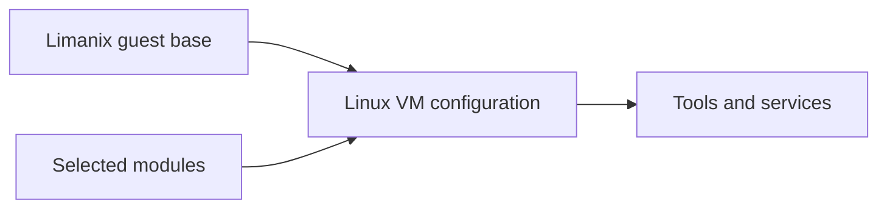

# Module concepts

A module describes tools, services, or settings for the Linux guest.
You can use the [catalog](catalog.md) without writing Nix.
This page explains the pieces you will meet when reading or writing a module.

## What a module changes



| File or component | Controls | Example |
| --- | --- | --- |
| `limanix.toml` | VM resources, shared directories, ports, and module selection | Select `lmx:python` |
| A NixOS module | Guest packages and system services | Install Python or enable Docker |
| Project files | Your application's code and dependencies | `package.json` or `pyproject.toml` |

Adding a module changes the VM's system configuration.
It does not install the tool on your Mac or install your project's application dependencies.

## Names you will meet

| Name | Meaning |
| --- | --- |
| Nix language | The language used in `.nix` files |
| Nix | The tool that evaluates Nix expressions and builds or downloads their results |
| Nixpkgs | A collection of packages and NixOS modules |
| NixOS | The Linux operating system configured by those modules |

For example, `pkgs.jq` is a **package** containing the `jq` program.
A **module** can add that package to the system:

```nix
{ pkgs, ... }:
{
  environment.systemPackages = [ pkgs.jq ];
}
```

## Read the Nix example

| Part | Meaning |
| --- | --- |
| `{ pkgs, ... }:` | A function that receives `pkgs` and accepts other arguments |
| The second `{ ... }` | A set of named values returned by that function |
| `environment.systemPackages` | The NixOS option being configured |
| `pkgs.jq` | The `jq` package from the supplied package collection |
| `[ ... ]` | A list, with spaces between entries |
| `;` | The end of an assignment |

NixOS supplies the function's arguments.
The most common are `pkgs` for packages, `lib` for helpers, and `config` for the combined configuration.
A module that needs no arguments can be a plain set:

```nix
{
  programs.git.enable = true;
}
```

The [Nix language tutorial](https://nix.dev/tutorials/nix-language.html) has more syntax examples.

## Find the right package or option

| You need… | Look up | Set |
| --- | --- | --- |
| A command-line tool | [NixOS packages](https://search.nixos.org/packages) | `environment.systemPackages` |
| A configured service | [NixOS options](https://search.nixos.org/options) | Its service options, such as `services.nginx.enable` |

A package's attribute can differ from its command name.
For example, `pkgs.ripgrep` provides `rg`.
The current catalog pins NixOS 26.05 as the guest base.
Clients use the pin from their bundled catalog.
Select that release when looking up packages and options.

```{tip}
Use a service's NixOS options when you want it configured and started.
Adding its executable to `environment.systemPackages` only makes the program available.
```

## Split a module into files

A `default.nix` can load another module beside it:

```nix
{
  imports = [ ./tools.nix ];
}
```

The path is relative to the file containing it.
Keep supporting files inside the directory you register with Limanix.

| Form | What it does |
| --- | --- |
| `imports = [ ./tools.nix ];` | Includes another NixOS module in the configuration |
| `import ./settings.nix` | Evaluates a Nix file and returns its value |

For a directory layout and working commands, follow [Write your first module](writing-modules.md).

## Combining modules

All selected modules contribute to one configuration.
NixOS combines their values according to each option's type and definition priorities.

| Definitions from different modules | Result |
| --- | --- |
| Two ordinary package lists | Both lists contribute packages |
| Two different ordinary values for the hostname | A conflicting-definition error |
| A suggested value with `lib.mkDefault` and an ordinary value | The ordinary value wins |

Reordering your selections is not a general way to override settings.
[Make a module configurable](reusable-modules.md) explains options, defaults, and deliberate overrides.

(module-nix-store)=
## Source files and the Nix store

Nix places source inputs and build results under `/nix/store/…`.
Store files are immutable.
To change an imported module, edit its original source and follow [Replace an imported module](https://limanix.dev/categories/client/modules.html#replace-an-imported-module).

```{warning}
Keep passwords, tokens, and private keys out of module source.
Source files and configuration values can enter the world-readable Nix store.
Use a service's runtime secret-file option when it provides one.
```

Read the [Nix store overview](https://nix.dev/manual/nix/2.35/store/) for more detail.
