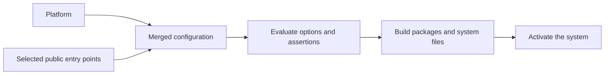

# Concepts

[NixOS](https://nixos.org/) is a Linux distribution built around the
[Nix package manager](https://nix.dev/manual/nix/stable/introduction.html). Its
[configuration](https://nixos.org/manual/nixos/stable/#sec-configuration-syntax)
describes packages, services and system settings. Nix builds the system from
that description.

## Packages, options, and modules

Nixpkgs supplies the base package collection and NixOS modules.

| Term | Meaning |
| -- | -- |
| Package | Software and its files |
| Option | A typed setting, such as a package list or service enable flag |
| Module | Nix code that declares options, assigns settings and imports modules |
| Selector | A catalog choice such as `lmx:python` or `lmx:python-3.12` |

Installing a package makes its programs available. Enabling a service can also
create users, write configuration and start a program at boot. Read the module's
page to know what its selection changes. [Write a module](writing-modules.md)
introduces the code for your own settings.

## One system for all modules

NixOS combines all module definitions before building one system. A module has
its own responsibilities, but shares the VM with other modules.



Evaluation computes the configuration; building creates its files; activation
makes it the running system. Successful evaluation alone does not prove that a
command runs or a service starts.

When modules define the same option, its type and definition priorities decide
the result:

| Definition | Result |
| -- | -- |
| Lists, such as `environment.systemPackages` | Combine their entries |
| Different strings at equal priority | Conflict |
| A `lib.mkDefault` value and an ordinary value | The ordinary value wins |

[Combine with other modules](writing-modules.md#combine-with-other-modules)
shows intentional overrides and conflict handling. Package priorities control
which installed command wins when packages provide the same filename; those are
separate from the priorities of option definitions.

## Platform and module boundaries

| Component | Responsibility |
| -- | -- |
| Platform | Base Nixpkgs, the public account interface and always-loaded schemas |
| Module | Its packages, additional pins, settings, integrations, tests and README |
| `_shared` | Generic capability schemas, pin resolution, data and helpers |
| Harness | Discover public metadata and execute declared checks |

The platform exists with `modules = []`. Loading a shared schema makes its
options available; selecting modules supplies optional applications and
capability providers. An aggregate chooses component modules through their
public entry points and owns its integration.

Use a module's public surfaces when extending it:

| Surface | Purpose |
| -- | -- |
| `module.toml` | Description, available lines and default recommendation |
| `default.nix`, `versions/<line>.nix` | Select the module's default or explicit line |
| `limanix.*` | Public account, shell and session interface |
| Documented `lmx.<name>.*` and standard NixOS options | User configuration |
| `lmx.capabilities.<area>.*` | Typed data shared by providers and consumers |
| `test.nix` | The module's declared configuration, runtime and activation checks |
| README | Usage, version policy, state, corner cases and tested guarantees |

Package recipes, test fixtures and `lmx.internal.<name>` belong to the owning
module. Other modules use the public interface. The
[catalog contract](catalog-contract.md) defines the complete boundaries.

## Connect modules

| Method | Use it when | Connection |
| -- | -- | -- |
| Dependency | A module needs another module's configuration | Import that module's public entry point |
| Capability | A provider and consumer exchange data | Publish and read a typed shared option |

NixOS handles repeated imports of the same entry point. A capability lets a
language module declare a server for an editor to consume, without either module
naming the other. Publishing a server does not enable an editor. Each schema
defines identity, merging and conflicts; consumers read its resolved values.

## Defaults and explicit lines

| Selection | Meaning |
| -- | -- |
| `lmx:<name>` | Use the module's default entry point; a versioned module recommends its metadata default |
| `lmx:<name>-<line>` | Select that supported line explicitly |
| Several explicit lines | Follow the module's documented coexistence policy or receive its specific conflict error |

An explicit line replaces the default recommendation, including one imported by
an aggregate. Selecting several lines does not silently discard a choice. Their
command names, command priorities, services and data layout belong to the
module's policy. [Catalog versions](catalog.md#versions) shows how to select
lines; each module page describes their behavior.

## NixOS version and package pins

This checkout selects **NixOS 26.05** in `flake.nix`; `flake.lock` fixes the
exact base Nixpkgs revision. That base provides NixOS options and the default
`pkgs` package collection. Use the same release in package and option searches
when writing a module.

A module can declare an additional revision in `lmx.pins`. Shared infrastructure
resolves it for the system's architecture and effective unfree policy. The
module owns its package choices. Pins fix sources; they do not follow the latest
upstream release. A selector line identifies a supported module choice; its
README lists the exact packages and the scope of that line.

## Catalog compatibility

| Version | Describes |
| -- | -- |
| Catalog release | The available modules, lines and defaults bundled with a client |
| Contract document revision | The reviewed module specification |
| Module line | The choice exposed through `lmx:<name>-<line>` |

Each client build bundles one catalog release and is tested with it. An
incompatible change to selectors, public options, capabilities or the test
interface ships together with the client changes that support it. Adding a line
or changing a module default belongs to a catalog release; removing a line also
needs migration notes.

## The Nix store

Packages live in `/nix/store` alongside their dependencies and the built system.
NixOS makes installed commands available on `PATH`. Store contents are
immutable: change the configuration and apply it instead of editing installed
files. A changed package gets a new store path.

## Trust and secrets

A module can install software, run services as root and read directories shared
with the VM. Use modules from sources you trust.

Files in `/nix/store` are readable by every user in the VM. Module sources and
generated configuration can end up there, including secrets written into them.

```{warning}
Keep passwords, tokens, and private keys out of modules.
For a service that needs a secret, use the service's secret-file option, if it has one, and create that file inside the VM.
```

## Next steps

- [Catalog](catalog.md): choose modules and read their version policies.
- [Write a module](writing-modules.md): add project settings or a catalog entry.
- [Catalog contract](catalog-contract.md): maintain public interfaces and tests.
- [NixOS manual](https://nixos.org/manual/nixos/stable/): explore the operating
  system beyond LimaNix.
