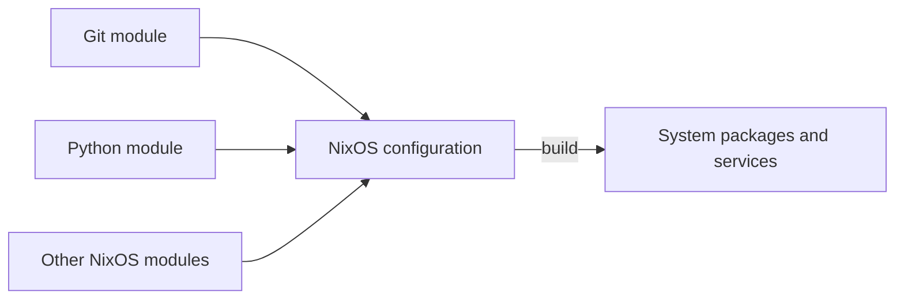

# Concepts

[NixOS](https://nixos.org/) is a Linux distribution built around the
[Nix package manager](https://nix.dev/manual/nix/stable/introduction.html). Its
[configuration](https://nixos.org/manual/nixos/stable/#sec-configuration-syntax)
describes which packages, services, and system settings to use, and Nix builds
the system from that description.

## Packages, options, and modules

Nixpkgs supplies the package collection and the NixOS modules used to build the
system. A package provides software, while an option describes a setting, such
as which packages to install or whether a service should run. Modules are
written in Nix and can declare options or assign values to existing ones. NixOS
combines their settings into one system configuration.

Installing a package and configuring a service are different tasks. A package
provides programs and files; a service's options can also create users, write
configuration files, and arrange for a program to start at boot. The
[catalog](catalog.md) provides ready-made modules;
[Write a module](writing-modules.md) introduces the code when you need your own
settings.

## One system for all modules

A module contributes part of a NixOS configuration, not a sequence of
installation commands. NixOS combines the definitions from all modules before
building the system.



When several modules define the same option, its type and the definitions'
priorities determine the result:

- Lists, such as `environment.systemPackages`, combine.
- Different values for a string option conflict when they have the same
  priority.
- A default marked with `lib.mkDefault` yields to an ordinary definition.

A module is not a container or a separate environment: its settings affect the
shared system.
[Combine with other modules](writing-modules.md#combine-with-other-modules)
shows how to handle conflicts and intentional overrides.

## NixOS version and package pins

This catalog pins **NixOS 26.05** and an exact Nixpkgs revision in its
`flake.lock`. That revision provides the NixOS options and the default `pkgs`
package set available to modules.

Pins fix the package sources instead of following their latest upstream
versions. The [catalog's version lines](catalog.md#versions) distinguish the
versions a module provides. When writing a module, search for packages and
options in the NixOS 26.05 release.

## The Nix store

The packages selected by the configuration live in `/nix/store`, alongside their
dependencies and the built system. NixOS makes system-installed commands
available on `PATH`; you do not need to type their store paths. Store contents
are immutable: change the configuration and apply it instead of editing
installed files there. When a package changes, Nix creates a new store path
instead of overwriting existing files.

## Trust and secrets

A module has full control over the VM. It can install software, run services as
root, and read the directories you share with the VM. Use modules only from
sources you trust.

Files in `/nix/store` are readable by every user in the VM. Module sources and
generated configuration can end up there, including any secrets written into
them.

```{warning}
Keep passwords, tokens, and private keys out of modules.
For a service that needs a secret, use the service's secret-file option, if it has one, and create that file inside the VM.
```

## Next steps

- [Catalog](catalog.md): choose ready-made modules for your VM.
- [Write a module](writing-modules.md): define packages, programs, and services
  in Nix.
- [NixOS manual](https://nixos.org/manual/nixos/stable/): explore the operating
  system beyond LimaNix.
