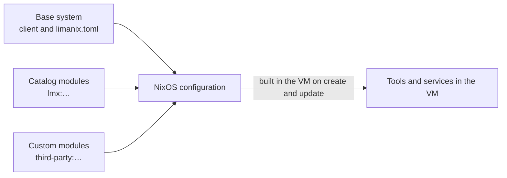

---
myst:
  heading_anchors: 2
---

# Concepts

Limanix builds each VM from a single NixOS configuration.
The client contributes a base system, and the modules you select add everything else.



## The base system

The client reads these settings from `limanix.toml`:

- the guest account, its home directory, and its `sudo` access;
- the hostname, shared directories, and environment values;
- firewall ports from `network.ports`;
- VM resources, including disk size.

Set these values in `limanix.toml`.
A module that sets a different hostname, for example, makes the build fail with a conflict.

The client also supplies the boot, filesystem, and SSH configuration internally.
These settings are not exposed in `limanix.toml`.
Modules build on this base.

## Select modules

List modules in the `nixos.modules` setting of `limanix.toml`:

```toml
[nixos]
modules = ["lmx:git", "lmx:python-3.12", "third-party:dev-tools"]
```

| Selector | Selects |
| --- | --- |
| `lmx:NAME` | Catalog entry `NAME` at its default version |
| `lmx:NAME-VERSION` | A version line of a catalog entry, such as `lmx:python-3.12` |
| `third-party:NAME` | A custom module that you imported into the client's registry |

The catalog ships inside the client: each client release bundles one release of this repository.
Selecting `lmx:` modules therefore fetches no module code from the network, although the VM still downloads the packages that they install.
Custom modules come from the client's local registry, which you manage with `limanix modules add` and `limanix modules remove`.
The client guide covers these commands in [Choose and manage modules](https://limanix.dev/categories/client/modules.html).

## When changes apply

Selecting, editing, or removing a module changes nothing on its own.
The change reaches the VM when the client creates or updates it:

1. The client copies each selected module into the VM's configuration: catalog modules from its bundled catalog, and custom modules from its registry.
2. The VM builds the new NixOS system, downloading or building the packages it needs.
3. The VM restarts into the new system.

Because the client works with copies, editing a custom module's files has no effect until you [replace the imported module](https://limanix.dev/categories/client/modules.html#replace-an-imported-module) and update the VM.

Removing a module from `nixos.modules` removes its packages and services with the next update.
Data they created, such as Docker images or database files, stays on the VM's disk.

## One system for all modules

All selected modules configure the same system.
Nothing isolates them from each other: they share one filesystem, one set of users, one `PATH`, and one network.
Containers run with the [Docker module](../catalog/docker/README.md) are the exception.

When several modules define the same settings, NixOS merges them:

- Lists, such as `environment.systemPackages`, combine.
- Two different values for a single-value option stop the build, unless one module marks its value as a default.
- When two packages provide the same command, only one of them is on `PATH`.

[Combine with other modules](writing-modules.md#combine-with-other-modules) explains how to resolve both cases.

## NixOS version and package pins

This catalog pins **NixOS 26.05** and an exact Nixpkgs revision in its `flake.lock`.
The client uses the pin from its bundled catalog as the base package collection for every VM it builds.

| Packages from | Examples | Change when |
| --- | --- | --- |
| The base Nixpkgs revision | Git, Neovim, the GCC in the Go and Rust modules, and `pkgs` in custom modules | A client release bundles a catalog with a new base pin |
| A catalog module's own pin | Docker, Go, Minikube, Node.js, Python, and Rust | A catalog release updates that module |

Search for packages and options in the NixOS 26.05 release.
A [version line](catalog.md#versions) selects which of a module's own pins the VM uses.

## Trust and secrets

A module has full control over the VM.
It can install software, run services as root, and read the directories you share with the VM.
Import custom modules only from sources you trust.

Everything in `/nix/store` is readable by every user in the VM, and module source files and the configuration files that NixOS generates end up there.

```{warning}
Keep passwords, tokens, and private keys out of modules.
For a service that needs a secret, use the service's secret-file option, if it has one, and create that file inside the VM.
```
